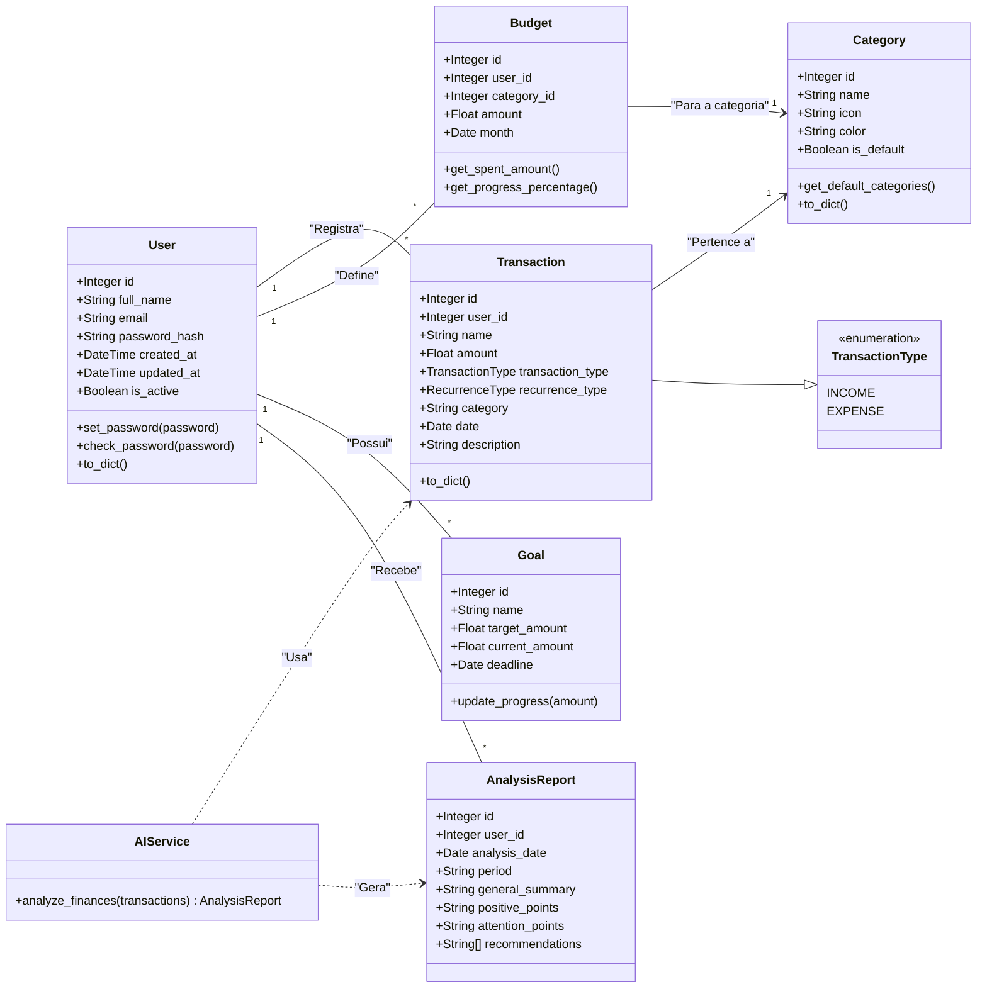

# CashMind - Sistema de Gestão Financeira Pessoal

<div align="center">
  
  
  
  
  
  
  
  
</div>

## 📋 Sobre o Projeto

CashMind é um sistema web de gestão financeira pessoal que utiliza inteligência artificial para fornecer insights e recomendações personalizadas sobre os hábitos financeiros dos usuários.

### ✨ Principais Funcionalidades
- **Dashboard Visual**: Resumo financeiro com saldo atual, total de receitas e despesas.

- **Registro de Transações**: Adicione, edite e remova facilmente suas receitas e despesas.

- **Categorização Inteligente**: Classifique suas transações para entender melhor seus gastos.

- **Análise com IA**: Receba um relatório detalhado com insights e dicas de economia gerado pela IA do Google.

- **Visualização Gráfica**: Gráficos interativos para analisar a distribuição de despesas por categoria.

- **Autenticação Segura**: Sistema de login e cadastro com proteção por JWT.

### 🎯 Problema que Resolve

- Dificuldade em controlar gastos pessoais
- Falta de visibilidade sobre padrões de consumo
- Ausência de recomendações personalizadas para economia
- Complexidade em categorizar e analisar transações financeiras

### 👥 Usuários-Alvo

- **Jovens profissionais**: Iniciando vida financeira independente
- **Famílias**: Buscando controle do orçamento doméstico
- **Estudantes**: Aprendendo educação financeira
- **Pequenos empreendedores**: Separando finanças pessoais e empresariais

## 🏗️ Arquitetura do Sistema

### Diagrama de Classes do Domínio



## 🛠️ Ferramentas e Tecnologias

### Sistema de Controle de Versão
- **Git**: Controle de versão distribuído
- **GitHub**: Hospedagem do repositório e colaboração

### Backend
- **Python 3.8+**: Linguagem principal
- **Flask 2.3.0**: Framework web
- **SQLAlchemy**: ORM para banco de dados
- **Flask-JWT-Extended**: Autenticação JWT
- **Flask-CORS**: Habilitação de CORS
- **SQLite**: Banco de dados

### Frontend
- **HTML5/CSS3/JavaScript**: Tecnologias base
- **Chart.js**: Gráficos e visualizações
- **Fetch API**: Comunicação com backend
- **JWT**: Autenticação no cliente

### Ferramentas de Build e Desenvolvimento
- **pip**: Gerenciador de pacotes Python
- **venv**: Ambientes virtuais Python
- **npm** (opcional): Para gerenciar dependências frontend

### Testes
- **pytest**: Framework de testes Python
- **pytest-cov**: Cobertura de testes
- **unittest**: Testes unitários nativos Python

### Documentação
- **Sphinx**: Documentação Python
- **JSDoc**: Documentação JavaScript
- **Markdown**: Documentação geral

### Container (Planejado)
- **Docker**: Containerização da aplicação
- **Docker Compose**: Orquestração de containers

### CI/CD (Planejado)
- **GitHub Actions**: Integração e deploy contínuos

## 📚 Frameworks e Bibliotecas

### Backend

#### Flask
Framework web minimalista para Python que fornece:
- Roteamento de URLs
- Gerenciamento de requisições/respostas
- Sistema de templates (não usado neste projeto)
- Integração com extensões

#### SQLAlchemy
ORM (Object-Relational Mapping) que:
- Mapeia classes Python para tabelas SQL
- Fornece query builder pythônico
- Gerencia migrações de banco
- Suporta múltiplos bancos de dados

#### Flask-JWT-Extended
Extensão para autenticação JWT que oferece:
- Geração de tokens de acesso/refresh
- Decoradores para proteção de rotas
- Gerenciamento de sessões
- Blacklist de tokens

### Frontend

#### Chart.js
Biblioteca de gráficos que permite:
- Gráficos responsivos
- Múltiplos tipos (linha, barra, pizza)
- Animações suaves
- Customização completa

## 📖 Geração de Documentação

### Documentação Python (Backend)

1. Instalar Sphinx:
```bash
pip install sphinx sphinx-rtd-theme
```

2. Inicializar documentação:
```bash
cd backend/docs
sphinx-quickstart
```

3. Gerar documentação:
```bash
make html
```

A documentação será gerada em `backend/docs/_build/html/`

### Documentação JavaScript (Frontend)

1. Instalar JSDoc:
```bash
npm install -g jsdoc
```

2. Criar arquivo de configuração `jsdoc.json`:
```json
{
  "source": {
    "include": ["frontend/scripts"],
    "includePattern": ".+\\.js(doc|x)?$"
  },
  "opts": {
    "destination": "./frontend/docs"
  }
}
```

3. Gerar documentação:
```bash
jsdoc -c jsdoc.json
```

## 🚀 Como Executar o Sistema

### Pré-requisitos
- Python 3.8 ou superior
- pip (gerenciador de pacotes Python)
- Git

### 1. Clonar o Repositório
```bash
git clone https://github.com/AntFe/CashMind---FrontEnd
cd CashMind---FrontEnd
```

### 2. Configurar o Backend

#### 2.1 Criar ambiente virtual
```bash
cd backend
python3 -m venv venv
```

#### 2.2 Ativar ambiente virtual

Windows:
```bash
venv\Scripts\activate
```

Linux/Mac:
```bash
source venv/bin/activate
```

#### 2.3 Instalar dependências
```bash
pip install -r requirements.txt
```

#### 2.4 Configurar variáveis de ambiente
Criar arquivo `.env` no diretório backend:
```env
# Flask
SECRET_KEY=dev-secret-key-cashmind-2024
FLASK_ENV=development

# JWT
JWT_SECRET_KEY=jwt-secret-cashmind-2024

# Google Gemini API (opcional - para funcionalidade de IA)
GOOGLE_API_KEY=sua-chave-api-aqui
```

**Nota**: O banco de dados SQLite é configurado automaticamente em `instance/cashmind.db`

#### 2.5 Executar servidor backend
```bash
python run.py
```

O backend estará disponível em `http://localhost:5000`

### 3. Configurar o Frontend

#### 3.1 Servir arquivos estáticos

Em um novo terminal, navegue até o diretório frontend e execute:

Usando Python:
```bash
cd frontend
python3 -m http.server 8000
```

#### 3.2 Acessar a aplicação

Abra o navegador e acesse: `http://localhost:8000`

## 🧪 Executar Testes

### Testes Backend
```bash
cd backend
pytest
```

### Testes com Cobertura
```bash
pytest --cov=app --cov-report=html
```

A cobertura será gerada em `htmlcov/index.html`

## 🐳 Docker (Em Desenvolvimento)

### Build da Imagem
```bash
docker build -t cashmind:latest .
```

### Executar Container
```bash
docker run -p 5000:5000 -p 8000:8000 cashmind:latest
```

## 📝 Estrutura do Projeto

```
CashMind/
├── backend/
│   ├── app/
│   │   ├── __init__.py
│   │   ├── models/
│   │   ├── routes/
│   │   └── services/
│   ├── tests/
│   ├── requirements.txt
│   └── run.py
├── frontend/
│   ├── index.html
│   ├── pages/
│   ├── scripts/
│   ├── styles/
│   └── content/
├── docs/
├── .gitignore
├── README.md
└── docker-compose.yml
```

## 🤝 Contribuindo

1. Fork o projeto
2. Crie sua feature branch (`git checkout -b feature/AmazingFeature`)
3. Commit suas mudanças (`git commit -m 'Add some AmazingFeature'`)
4. Push para a branch (`git push origin feature/AmazingFeature`)
5. Abra um Pull Request

## 📄 Licença

Este projeto é parte de um trabalho acadêmico da UFES.

## 👥 Equipe

- Antonio Ferreira
- Arthur Maciel
- Daniel Gobbi

---

Desenvolvido com 💚 para a disciplina de Projeto Integrador - UFES